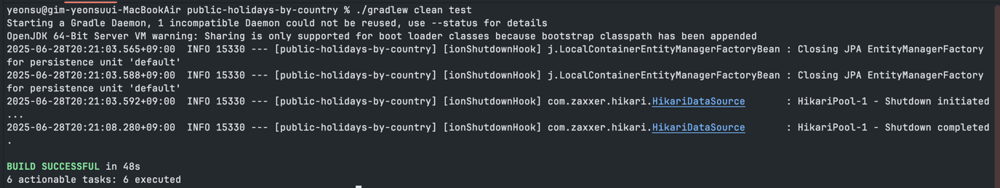
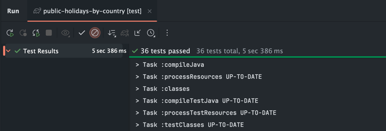
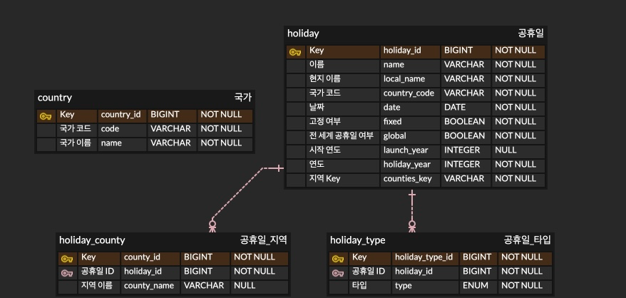

# 📅 Public Holidays by Country

외부 API를 통해 각 국가별 공휴일 정보를 조회하고 저장하는 프로젝트입니다.

---

## 📌️ 빌드 & 실행 방법

``` bash
# 1. 프로젝트 클론
git clone https://github.com/yeonsu00/public-holidays-by-country.git

# 2. 의존성 설치 및 빌드
./gradlew clean build

# 3. 실행
./gradlew bootRun
```

<br>

## 📌 REST API 요약

| 메서드    | 엔드포인트                                       | 설명                       |
|--------|---------------------------------------------|--------------------------|
| POST   | `/holidays`                                 | 외부 API에서 공휴일 데이터를 가져와 저장 |
| GET    | `/holidays`                                 | 연도별·국가별 필터 기반 공휴일 조회     |
| GET    | `/holidays/filter` | 필터 기반(date, type, county, fixed, global, launchYear, countryCode) 공휴일 조회           |
| PATCH  | `/holidays`                                 | 연도·국가별 공휴일 재동기화      |
| DELETE | `/holidays`                                 | 연도·국가별 공휴일 삭제     |

### 1️⃣ 외부 API에서 공휴일 데이터 가져오기
#### - GET /holidays
#### - 성공 응답 예시
```json
{
  "code": "SUCCESS",
  "message": "최근 5년 공휴일 1000개가 성공적으로 저장되었습니다."
}
```
#### - 실패 응답 예시
```json
{
  "code": "COUNTRY_NOT_FOUND",
  "message": "국가 목록 정보를 찾을 수 없습니다."
}
```
```json
{
  "code": "HOLIDAY_NOT_FOUND",
  "message": "2024년도 Korea의 공휴일 정보를 찾을 수 없습니다."
}
```

### 2️⃣ 연도별·국가별 공휴일 조회
#### - GET /holidays
#### - 파라미터
- year
    - `List<Integer>` (예: year=2024&year=2025)
    - 생략 시 전체 연도 대상
- countryCode
    - `List<String>` (예: countryCode=KR&countryCode=US)
    - 생략 시 전체 국가 대상
- page, size
    - 페이징 옵션 (기본값: page=0, size=10)
#### - 성공 응답 예시
```json
{
  "code": "SUCCESS",
  "message": "총 62개 중 10개의 공휴일이 조회되었습니다.",
  "data": [
    {
      "date": "2025-01-20",
      "localName": "Martin Luther King, Jr. Day",
      "name": "Martin Luther King, Jr. Day",
      "countryCode": "US",
      "fixed": false,
      "global": true,
      "counties": [],
      "launchYear": null,
      "types": [
        "Public"
      ]
    },
    ...
  ]
}
```

#### - 실패 응답 예시
```json
{
  "code": "INVALID_REQUEST",
  "message": "year는 양수여야 합니다."
}
```
```json
{
    "code": "INVALID_REQUEST",
    "message": "page는 0 이상이어야 합니다."
}
```
```json
{
    "code": "INVALID_REQUEST",
    "message": "size는 1 이상이어야 합니다."
}
```

### 3️⃣ 필터 기반 공휴일 조회
#### - GET /holidays/filter
#### - 파라미터
- from, to
    - `LocalDate` (예: from=2024-01-01&to=2024-12-31)
    - 생략 시 시작일 또는 종료일 제한 없음
- type
    - `List<String>` (예: type=Public&type=Bank)
    - 생략 시 전체 타입 대상
- hasCounty
    - `boolean` (예: hasCounty=true)
    - 생략 시 지역 포함 여부 제한 없음
- fixed
    - `boolean` (예: fixed=false)
    - 생략 시 고정 공휴일 여부 제한 없음
- global
    - `boolean` (예: global=true)
    - 생략 시 전 세계 공휴일 여부 제한 없음
- launchYear
    - `Integer` (예: launchYear=2024)
    - 생략 시 시작 연도 제한 없음
- countryCode
    - `List<String>` (예: countryCode=KR&countryCode=US)
    - 생략 시 전체 국가 대상
- page, size: 페이징 옵션 (기본값: page=0, size=10)
#### - 성공 응답 예시
```json
{
  "code": "SUCCESS",
  "message": "총 9개 중 9개의 공휴일이 조회되었습니다.",
  "data": [
    {
      "date": "2024-09-16",
      "localName": "추석",
      "name": "Chuseok",
      "countryCode": "KR",
      "fixed": false,
      "global": true,
      "counties": [],
      "launchYear": null,
      "types": [
        "Public"
      ]
    },
    ...
  ]
}
```
#### - 실패 응답 예시
```json
{
  "code": "INVALID_REQUEST",
  "message": "from 날짜는 to 날짜보다 이전이어야 합니다."
}
```
```json
{
  "code": "INVALID_REQUEST",
  "message": "launchYear는 1000 이상이어야 합니다."
}
```
```json
{
"code": "INVALID_REQUEST",
"message": "page는 0 이상이어야 합니다."
}
```
```json
{
    "code": "INVALID_REQUEST",
    "message": "size는 1 이상이어야 합니다."
}
```


### 4️⃣ 연도·국가별 공휴일 재동기화
#### - PATCH /holidays
#### - Request Body
```json
{
  "year": 2024,
  "countryCode": "KR"
}
```
#### - 성공 응답 예시
```json
{
  "code": "SUCCESS",
  "message": "123개의 공휴일이 재동기화되었습니다."
}
```
#### - 실패 응답 예시
```json
{
  "code": "HOLIDAY_NOT_FOUND",
  "message": "2024년도 Korea의 공휴일 정보를 찾을 수 없습니다."
}
```
```json
{
  "code": "INVALID_REQUEST",
  "message": "연도는 필수입니다."
}
```
```json
{
  "code": "INVALID_REQUEST",
  "message": "국가 코드는 필수입니다."
}
```

### 5️⃣ 연도·국가별 공휴일 삭제
#### - DELETE /holidays
#### - Request Body
```json
{
  "year": 2024,
  "countryCode": "KR"
}
```
#### - 성공 응답 예시
```json
{
  "code": "SUCCESS",
  "message": "123개의 공휴일이 삭제되었습니다."
}
```
#### - 실패 응답 예시
```json
{
  "code": "INVALID_REQUEST",
  "message": "연도는 필수입니다."
}
```
```json
{
  "code": "INVALID_REQUEST",
  "message": "국가 코드는 필수입니다."
}
```


<br>

## 📌 그 외 기능
### 1️⃣ 공휴일 데이터 일괄 적재 자동화 (서버 실행 시)
- 서버 실행 시 자동으로 외부 API에서 국가/공휴일 데이터를 가져와 저장한다.

### 2️⃣ 공휴일 데이터 동기화 배치 (자동 실행)
- 매년 1월 2일 01:00 KST에 전년도·금년도 데이터를 자동 동기화한다.

<br>

## 📌 테스트
``` bash
# 테스트 실행
./gradlew clean test
```

### 테스트 성공 스크린샷



36개 테스트 모두 통과했습니다.

<br>

## 📌 Swagger UI / OpenAPI 확인 방법
- Swagger UI: http://localhost:8080/swagger-ui.html
- OpenAPI JSON: http://localhost:8080/v3/api-docs


<br>

## 📌 ERD 


